<<<<<<< HEAD
项目文档

项目小组：夸夸群   成员：刘瑞 原浩强 陈晨 夏立超 宁玉贤 蔡迪雅


第一章：开发环境

树莓派由注册于英国的慈善组织“Raspberry Pi 基金会”开发，Eben·Upton/埃·厄普顿为项目带头人。2012年3月，英国剑桥大学埃本·阿普顿（Eben Epton）正式发售世界上最小的台式机，又称卡片式电脑，外形只有信用卡大小，却具有电脑的所有基本功能，这就是Raspberry Pi电脑板，中文译名"树莓派"。
它是一款基于ARM的微型电脑主板，以SD/MicroSD卡为内存硬盘，卡片主板周围有1/2/4个USB接口和一个10/100 以太网接口（A型没有网口），可连接键盘、鼠标和网线，同时拥有视频模拟信号的电视输出接口和HDMI高清视频输出接口，以上部件全部整合在一张仅比信用卡稍大的主板上，具备所有PC的基本功能只需接通电视机和键盘，就能执行如电子表格、文字处理、玩游戏、播放高清视频等诸多功能。 Raspberry Pi B款只提供电脑板，无内存、电源、键盘、机箱或连线。

一.  执行环境（硬件环境）
树莓派目前已有种类如下：


其相关参数如下：
 

以树莓派3B为例，结构如下图：


上面显示的硬件组件如下：
HDMI（高清晰度多媒体接口）：用于将未压缩的视频或数字音频数据传输到计算机监视器，数字电视等。通常，此HDMI端口有助于将树莓派连接到数字电视。

CSI摄像头接口： CSI（摄像头串行接口）接口在Broadcom处理器和Pi摄像头之间提供连接。该接口提供两个设备之间的电连接。

DSI显示器接口： DSI（显示器串行接口）显示器接口用于使用15针带状电缆将LCD连接到树莓派。DSI提供快速的高分辨率显示接口，专门用于将视频数据直接从GPU发送到LCD显示器。

复合视频和音频输出：复合视频和音频输出端口将视频和音频信号传输到音频/视频系统。

电源指示灯：用于电源指示的红色指示灯。电源连接到树莓派时，该指示灯将点亮。它直接连接到5V，并且只要电源电压降到4.63V以下就会开始闪烁。

ACT PWR： ACT PWR是显示SD卡活动的绿色LED。

SD卡和存储设备：最大可使用32GB的SD卡，也可以连接U盘与USB移动硬盘来扩展存储。SD卡容量的最低需求，理论上2GB，但为了给新的程序和文件保留空间，实际使用时不可低于4GB。建议SD卡选择速度等级为Class10的，可以用满树莓派对SD卡的读写能力，最大限度提高速度。推荐SanDisk Ultra Class10 TF 8GB这张卡，应用广泛且便宜成熟。8GB是推荐的大小，方便备份恢复，容量太大将导致存储不够灵活。

树莓派3B的CPU型号为BCM2837，这个芯片保留了与BCM2835和BCM2836完全相同的基础架构。所以，所有的树莓派工程和对树莓派硬件的准确描述教程都会完整的兼容。一个900MHz 32位的四核Cortex-A7 CPU被一个自定义的1.2GHz 64位四核Cortex-A53 ARM取代。这个新的芯片包含了增强33%的系统时钟速率以及各种架构上的增强，在性能上比树莓派2要提升50%-60%，或者粗略的说要比最原始的树莓派性能提升10倍。

GPU：树莓派所使用的BCM2835 SoC采用了Broadcom VideoCore IV图像处理器，能够提供模糊的质量播放，（为H.264提供40MBits/s的速度大小）。可使用提供的OpenGL ES2.0和OpenVG库访问快速3D核心。开放GL ES 2.0，硬件加速的OpenVG，以及1080p30 H.264高级解码。具有1Gpixel/s, 1.5Gtexel/s或24 GFLOPs的通用计算能力，并具有丰富的纹理滤波和DMA基础设施。

早期的树莓派的概念来源于Atmel的ATmega644单片机。也就是将电脑机箱里的大部分东西都集成到了一块电路板上的微型电脑，其硬件设计使得树莓派自带完整的系统，功能完善扩展性强。

二.	 运行环境（软件环境）

树莓派支持多种操作系统，包括比较通用的操作系统，多媒体应用系统，游戏模拟器系统和其他等。比较热门的8种操作系统为Raspbian ，RISC OS Pi，Firefox OS，Kali Linux，Raspbmc/Kodi，OpenELEC，Pidora，OpenMSX。
1. Raspbian
Raspbian是默认的最常用于Raspberry Pi的免费操作系统。Raspbian是基于Debian的一个版本（针对Raspberry Pi硬件Debian进行了专门的优化，并构建了超过35000个Raspbian包）。
Raspbian仍处于积极开发状态，并把重点放在提升尽可能多Debian包的稳定性和性能。对于初学编程的人来说这是一个很好的起点，Raspbian自带的x windows，因此可以使用它类似WIN风格的GUI界面，Raspbian还包括一个“Pi商店”，你可以免费或付费下载一些应用，比如Libre Office、Free Civ（游戏）等等。
2. RISC OS Pi
RISC OS最初是由剑桥Acorn Computers Ltd公司设计的一个操作系统，并于1987年首次发布，它是被专门设计运行于ARM芯片上，由命令行界面和桌面环境组成的视窗系统。
RISC OS Pi是RISC OS一个伟大的分水岭，同时，也意味着Raspberry Pi即将成为RISC OS这一轻便、精简、原创的基于ARM的操作系统巨大的驱动力。
3. Firefox OS
Firefox OS（专案也叫Boot to Gecko/B2G）是一个基于Linux的开源操作系统，应用于智能手机和平板电脑。采用开放网络（open Web）技术，它是一种网络作业环境，以Gecko浏览器引擎为核心，采用HTML 5来开发。诺基亚的工程师Oleg Romashin成功的将Firefox OS移植到廉价电脑Raspberry Pi上。从中可以看到Firefox OS成功的调用了Raspberry Pi的OpenGL加速，WebGL应用也可以稳定运行。
4. Kali Linux
Kali Linux是基于Debian的Linux发行版， 设计用于数字取证和渗透测试。Kali Linux预装了许多渗透测试软件，包括nmap (端口扫描器)、Wireshark (数据包分析器)、John the Ripper (密码破解器)，以及Aircrack-ng (一应用于对无线局域网进行渗透测试的软件)。用户可通过硬盘、live CD或live USB运行Kali Linux。Metasploit的Metasploit Framework支持Kali Linux，Metasploit一套针对远程主机进行开发和执行Exploit代码的工具。
5. Raspbmc/Kodi
Raspbmc是一个优秀的免费和开源的媒体中心软件，通常被称为XBMC（现在改名为Kodi）。它是基于Debian Linux发行版，它有一个10英寸的用户界面，你可以使用Raspbmc播放和浏览大多数的视频、音乐、播客和其他一些数字媒体文件。它支持有线和Wi-Fi、多种语言、自动更新，最棒的是，如果你想把Raspberry Pi 作为XBMC的前端，那么你可以在没有相关知识下正确的做到。
6. OpenELEC
OpenELEC（开放嵌入式Linux娱乐中心）基于Kodi/XBMC，提供包括家庭影院PC所需的各类软件，也适用于Raspberry Pi。它主打轻量级和流线型的设计，以便启动的更快。功能类似于Raspbmc，但有其自己的设置和配置区域。
7. Pidora
Pidora是适用于Raspberry Pi的一款操作系统，基于Fedora。Pidora虽然有点类似于Raspbian，但还是有些分布和少数软件的不同，包括文本编辑器、编程语言等等。
8. OpenMSX
OpenMSX是一个开源MSX模拟器，旨在模拟MSX（MSX个人电脑，是于1983年由美国微软提出的8位和16位主机的通称）。
树莓派开发板没有配置板载FLASH，因为它支持SD卡启动，所有我们可以下载相应镜像，并将其烧写在SD上，启动系统即可(这个镜像里即包含了通常所说的bootloader、kernel、文件系统)。‘

树莓派系统安装具体步骤如下 ：
1.镜像下载
首先去树莓派官网下载镜像。（有些SD卡已经内置了镜像可以跳过该部分）。其中NOOBS是专为Raspberry pi打造的简单易用的图形界面的操作系统管理工具。选择任一进行下载。
2.烧写工具安装
双击打开Win32DiskImager.exe，一路Next将其安装到固定位置。在第五步“Select additional tasks”中要勾选“Create a desktop icon（创建桌面图标）”。如果不慎没有勾选，则使用windows开始菜单的“查找”。
3.镜像烧写
解压下载的系统压缩文件，得到img镜像文件。将SD使用卡托或者读卡器后，连上电脑。并运行win32diskimager工具。 在软件中选择img文件，“设置”下选择SD的盘符，然后选择“写入”。
最终写入完成即安装成功。

三.	  编程环境：

编辑器：所有的 Unix Like 系统都会内建 vi 文书编辑器，其他的文书编辑器则不一定会存在。Vim是从 vi 发展出来的一个文本编辑器。代码补完、编译及错误跳转等方便编程的功能特别丰富。

编译器：GCC（GNU Compiler Collection，GNU编译器套件），是由 GNU 开发的编程语言编译器。GCC 原名为 GNU C 语言编译器（GNU C Compiler），因为它原本只能处理 C语言。GCC 很快地扩展，变得可处理 C++。后来又扩展能够支持更多编程语言，如Fortran、Pascal、Objective-C、Java、Ada、Go以及各类处理器架构上的汇编语言等，所以改名GNU编译器套件（GNU Compiler Collection）。GCC的外部接口长得像一个标准的Unix编译器。使用者在命令列下键入gcc之程序名，以及一些命令参数，以便决定每个输入档案使用的个别语言编译器，并为输出程序码使用适合此硬件平台的组合语言编译器，并且选择性地执行连接器以制造可执行的程序。

调试器：UNIX及UNIX-like下的调试工具。一般来说，GDB主要帮助你完成下面四个方面的功能：启动你的程序，可以按照你的自定义的要求随心所欲的运行程序。可让被调试的程序在你所指定的调置的断点处停住。（断点可以是条件表达式）。当程序被停住时，可以检查此时你的程序中所发生的事。你可以改变你的程序，将一个BUG产生的影响修正从而测试其他BUG。

工程管理器：make是一种可以提高编译效率的可以实现自动编译的工程管理器。

Make实现自动编译主要体现在以下两点： 
1)	按照Makefile的编译规则；
2)	通过检查时间戳检查文件是否被修改，没修改则不会被编译。

Makefile文件是脚本文件，需要使用脚本语言。脚本一般用来实现批处理，脚本语言一般做测试用。在写Makefile文件时，可以用两种代码，一种直接生成可执行文件，另一种是先生成目标文件，然后再生成可执行文件。一般情况下选择先生成目标文件再生成可执行文件。

树莓派可以用python编程，Python 是一款非常容易使用的脚本语言，它的语法简洁，使用简单，功能强大，容易扩展。而且python有强大的社区支持，有非常多的库可以使用，它的网络功能和计算功能也很强，可以方便的和其它语言配合使用，使用者也可以开发自己库，因此python被广泛应用于工程管理、网络编程、科学计算、人工智能、机器人、教育等许多行业，python语言也长期在编程语言排行榜上处于前五的位置。更重要的是python也是完全开源的，不像Windows、Java那样受到某些大公司的控制和影响，它完全是靠社区在推动和维护，所以python受到越来越多的开发者青睐。不过遗憾的是，因为受到硬件成本、运行性能、开发习惯等一些原因的影响，前些年python并没有在通用嵌入式方面得到太多的应用。任何ARMv6架构编译的语言都可以用于树莓派，一般采用并推Python。

运行程序要求：总体上说，只要需要运行的程序能在ARMv6架构下编译即可运行。（对于多数的Linux软件原则上都可以）。


第二章：需求分析

1.  项目名称：基于树莓派的停车场系统

2.  项目结构图


3.  功能需求

（1） 功能性需求


（2） 非功能性需求


4.  项目所需的软硬件条件

（1） 软件条件

Host端：Linux操作系统、GCC编译器、GDB调试器

Target端：


（2） 硬件条件

Host端：PC、网线

Target端：


=======
项目文档

项目小组：夸夸群   成员：刘瑞 原浩强 陈晨 夏立超 宁玉贤 蔡迪雅


# 第一章：开发环境

树莓派由注册于英国的慈善组织“Raspberry Pi 基金会”开发，Eben·Upton/埃·厄普顿为项目带头人。2012年3月，英国剑桥大学埃本·阿普顿（Eben Epton）正式发售世界上最小的台式机，又称卡片式电脑，外形只有信用卡大小，却具有电脑的所有基本功能，这就是Raspberry Pi电脑板，中文译名"树莓派"。
它是一款基于ARM的微型电脑主板，以SD/MicroSD卡为内存硬盘，卡片主板周围有1/2/4个USB接口和一个10/100 以太网接口（A型没有网口），可连接键盘、鼠标和网线，同时拥有视频模拟信号的电视输出接口和HDMI高清视频输出接口，以上部件全部整合在一张仅比信用卡稍大的主板上，具备所有PC的基本功能只需接通电视机和键盘，就能执行如电子表格、文字处理、玩游戏、播放高清视频等诸多功能。 Raspberry Pi B款只提供电脑板，无内存、电源、键盘、机箱或连线。

## 一.  执行环境（硬件环境）
树莓派目前已有种类如下：


其相关参数如下：
 

以树莓派3B为例，结构如下图：


上面显示的硬件组件如下：
HDMI（高清晰度多媒体接口）：用于将未压缩的视频或数字音频数据传输到计算机监视器，数字电视等。通常，此HDMI端口有助于将树莓派连接到数字电视。

CSI摄像头接口： CSI（摄像头串行接口）接口在Broadcom处理器和Pi摄像头之间提供连接。该接口提供两个设备之间的电连接。

DSI显示器接口： DSI（显示器串行接口）显示器接口用于使用15针带状电缆将LCD连接到树莓派。DSI提供快速的高分辨率显示接口，专门用于将视频数据直接从GPU发送到LCD显示器。

复合视频和音频输出：复合视频和音频输出端口将视频和音频信号传输到音频/视频系统。

电源指示灯：用于电源指示的红色指示灯。电源连接到树莓派时，该指示灯将点亮。它直接连接到5V，并且只要电源电压降到4.63V以下就会开始闪烁。

ACT PWR： ACT PWR是显示SD卡活动的绿色LED。

SD卡和存储设备：最大可使用32GB的SD卡，也可以连接U盘与USB移动硬盘来扩展存储。SD卡容量的最低需求，理论上2GB，但为了给新的程序和文件保留空间，实际使用时不可低于4GB。建议SD卡选择速度等级为Class10的，可以用满树莓派对SD卡的读写能力，最大限度提高速度。推荐SanDisk Ultra Class10 TF 8GB这张卡，应用广泛且便宜成熟。8GB是推荐的大小，方便备份恢复，容量太大将导致存储不够灵活。

树莓派3B的CPU型号为BCM2837，这个芯片保留了与BCM2835和BCM2836完全相同的基础架构。所以，所有的树莓派工程和对树莓派硬件的准确描述教程都会完整的兼容。一个900MHz 32位的四核Cortex-A7 CPU被一个自定义的1.2GHz 64位四核Cortex-A53 ARM取代。这个新的芯片包含了增强33%的系统时钟速率以及各种架构上的增强，在性能上比树莓派2要提升50%-60%，或者粗略的说要比最原始的树莓派性能提升10倍。

GPU：树莓派所使用的BCM2835 SoC采用了Broadcom VideoCore IV图像处理器，能够提供模糊的质量播放，（为H.264提供40MBits/s的速度大小）。可使用提供的OpenGL ES2.0和OpenVG库访问快速3D核心。开放GL ES 2.0，硬件加速的OpenVG，以及1080p30 H.264高级解码。具有1Gpixel/s, 1.5Gtexel/s或24 GFLOPs的通用计算能力，并具有丰富的纹理滤波和DMA基础设施。

早期的树莓派的概念来源于Atmel的ATmega644单片机。也就是将电脑机箱里的大部分东西都集成到了一块电路板上的微型电脑，其硬件设计使得树莓派自带完整的系统，功能完善扩展性强。

## 二.	 运行环境（软件环境）

树莓派支持多种操作系统，包括比较通用的操作系统，多媒体应用系统，游戏模拟器系统和其他等。比较热门的8种操作系统为Raspbian ，RISC OS Pi，Firefox OS，Kali Linux，Raspbmc/Kodi，OpenELEC，Pidora，OpenMSX。
1. Raspbian
Raspbian是默认的最常用于Raspberry Pi的免费操作系统。Raspbian是基于Debian的一个版本（针对Raspberry Pi硬件Debian进行了专门的优化，并构建了超过35000个Raspbian包）。
Raspbian仍处于积极开发状态，并把重点放在提升尽可能多Debian包的稳定性和性能。对于初学编程的人来说这是一个很好的起点，Raspbian自带的x windows，因此可以使用它类似WIN风格的GUI界面，Raspbian还包括一个“Pi商店”，你可以免费或付费下载一些应用，比如Libre Office、Free Civ（游戏）等等。
2. RISC OS Pi
RISC OS最初是由剑桥Acorn Computers Ltd公司设计的一个操作系统，并于1987年首次发布，它是被专门设计运行于ARM芯片上，由命令行界面和桌面环境组成的视窗系统。
RISC OS Pi是RISC OS一个伟大的分水岭，同时，也意味着Raspberry Pi即将成为RISC OS这一轻便、精简、原创的基于ARM的操作系统巨大的驱动力。
3. Firefox OS
Firefox OS（专案也叫Boot to Gecko/B2G）是一个基于Linux的开源操作系统，应用于智能手机和平板电脑。采用开放网络（open Web）技术，它是一种网络作业环境，以Gecko浏览器引擎为核心，采用HTML 5来开发。诺基亚的工程师Oleg Romashin成功的将Firefox OS移植到廉价电脑Raspberry Pi上。从中可以看到Firefox OS成功的调用了Raspberry Pi的OpenGL加速，WebGL应用也可以稳定运行。
4. Kali Linux
Kali Linux是基于Debian的Linux发行版， 设计用于数字取证和渗透测试。Kali Linux预装了许多渗透测试软件，包括nmap (端口扫描器)、Wireshark (数据包分析器)、John the Ripper (密码破解器)，以及Aircrack-ng (一应用于对无线局域网进行渗透测试的软件)。用户可通过硬盘、live CD或live USB运行Kali Linux。Metasploit的Metasploit Framework支持Kali Linux，Metasploit一套针对远程主机进行开发和执行Exploit代码的工具。
5. Raspbmc/Kodi
Raspbmc是一个优秀的免费和开源的媒体中心软件，通常被称为XBMC（现在改名为Kodi）。它是基于Debian Linux发行版，它有一个10英寸的用户界面，你可以使用Raspbmc播放和浏览大多数的视频、音乐、播客和其他一些数字媒体文件。它支持有线和Wi-Fi、多种语言、自动更新，最棒的是，如果你想把Raspberry Pi 作为XBMC的前端，那么你可以在没有相关知识下正确的做到。
6. OpenELEC
OpenELEC（开放嵌入式Linux娱乐中心）基于Kodi/XBMC，提供包括家庭影院PC所需的各类软件，也适用于Raspberry Pi。它主打轻量级和流线型的设计，以便启动的更快。功能类似于Raspbmc，但有其自己的设置和配置区域。
7. Pidora
Pidora是适用于Raspberry Pi的一款操作系统，基于Fedora。Pidora虽然有点类似于Raspbian，但还是有些分布和少数软件的不同，包括文本编辑器、编程语言等等。
8. OpenMSX
OpenMSX是一个开源MSX模拟器，旨在模拟MSX（MSX个人电脑，是于1983年由美国微软提出的8位和16位主机的通称）。
树莓派开发板没有配置板载FLASH，因为它支持SD卡启动，所有我们可以下载相应镜像，并将其烧写在SD上，启动系统即可(这个镜像里即包含了通常所说的bootloader、kernel、文件系统)。‘

树莓派系统安装具体步骤如下 ：
1.镜像下载
首先去树莓派官网下载镜像。（有些SD卡已经内置了镜像可以跳过该部分）。其中NOOBS是专为Raspberry pi打造的简单易用的图形界面的操作系统管理工具。选择任一进行下载。
2.烧写工具安装
双击打开Win32DiskImager.exe，一路Next将其安装到固定位置。在第五步“Select additional tasks”中要勾选“Create a desktop icon（创建桌面图标）”。如果不慎没有勾选，则使用windows开始菜单的“查找”。
3.镜像烧写
解压下载的系统压缩文件，得到img镜像文件。将SD使用卡托或者读卡器后，连上电脑。并运行win32diskimager工具。 在软件中选择img文件，“设置”下选择SD的盘符，然后选择“写入”。
最终写入完成即安装成功。

## 三.	  编程环境：

编辑器：所有的 Unix Like 系统都会内建 vi 文书编辑器，其他的文书编辑器则不一定会存在。Vim是从 vi 发展出来的一个文本编辑器。代码补完、编译及错误跳转等方便编程的功能特别丰富。

编译器：GCC（GNU Compiler Collection，GNU编译器套件），是由 GNU 开发的编程语言编译器。GCC 原名为 GNU C 语言编译器（GNU C Compiler），因为它原本只能处理 C语言。GCC 很快地扩展，变得可处理 C++。后来又扩展能够支持更多编程语言，如Fortran、Pascal、Objective-C、Java、Ada、Go以及各类处理器架构上的汇编语言等，所以改名GNU编译器套件（GNU Compiler Collection）。GCC的外部接口长得像一个标准的Unix编译器。使用者在命令列下键入gcc之程序名，以及一些命令参数，以便决定每个输入档案使用的个别语言编译器，并为输出程序码使用适合此硬件平台的组合语言编译器，并且选择性地执行连接器以制造可执行的程序。

调试器：UNIX及UNIX-like下的调试工具。一般来说，GDB主要帮助你完成下面四个方面的功能：启动你的程序，可以按照你的自定义的要求随心所欲的运行程序。可让被调试的程序在你所指定的调置的断点处停住。（断点可以是条件表达式）。当程序被停住时，可以检查此时你的程序中所发生的事。你可以改变你的程序，将一个BUG产生的影响修正从而测试其他BUG。

工程管理器：make是一种可以提高编译效率的可以实现自动编译的工程管理器。

Make实现自动编译主要体现在以下两点： 
1)	按照Makefile的编译规则；
2)	通过检查时间戳检查文件是否被修改，没修改则不会被编译。

Makefile文件是脚本文件，需要使用脚本语言。脚本一般用来实现批处理，脚本语言一般做测试用。在写Makefile文件时，可以用两种代码，一种直接生成可执行文件，另一种是先生成目标文件，然后再生成可执行文件。一般情况下选择先生成目标文件再生成可执行文件。

树莓派可以用python编程，Python 是一款非常容易使用的脚本语言，它的语法简洁，使用简单，功能强大，容易扩展。而且python有强大的社区支持，有非常多的库可以使用，它的网络功能和计算功能也很强，可以方便的和其它语言配合使用，使用者也可以开发自己库，因此python被广泛应用于工程管理、网络编程、科学计算、人工智能、机器人、教育等许多行业，python语言也长期在编程语言排行榜上处于前五的位置。更重要的是python也是完全开源的，不像Windows、Java那样受到某些大公司的控制和影响，它完全是靠社区在推动和维护，所以python受到越来越多的开发者青睐。不过遗憾的是，因为受到硬件成本、运行性能、开发习惯等一些原因的影响，前些年python并没有在通用嵌入式方面得到太多的应用。任何ARMv6架构编译的语言都可以用于树莓派，一般采用并推Python。

运行程序要求：总体上说，只要需要运行的程序能在ARMv6架构下编译即可运行。（对于多数的Linux软件原则上都可以）。


# 第二章：需求分析

## 1.  项目名称：基于树莓派的停车场系统

## 2.  项目结构图

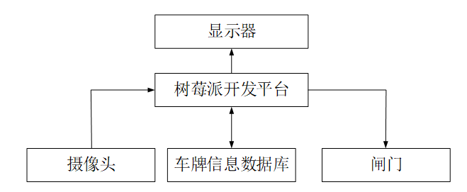

## 3.  功能需求

（1） 功能性需求

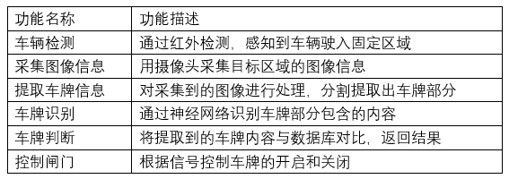

（2） 非功能性需求

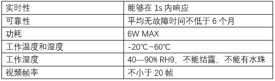

## 4.  项目所需的软硬件条件

（1） 软件条件

Host端：Linux操作系统、GCC编译器、GDB调试器

Target端：

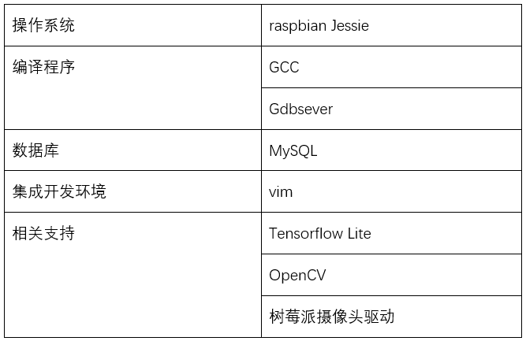

（2） 硬件条件

Host端：PC、网线

Target端：

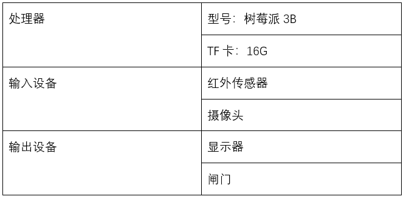

# 第三章 构建目标系统

## 1.获取内核源码并配置编译内核

- 在虚拟机上从github上下载最新内核源码和交叉编译工具

```
$ mkdir raspeberrypi_src
$ cd raspberrypi_src
$ git clone git://github.com/raspberrypi/linux.git
$ git clone git://github.com/raspberrypi/tools.git
```
- 进入下载得到的linux目录下，使用系统默认的配置内核编译


- 对内核进行编译
```
make ARCH=arm CROSS_COMPILE=arm-linux-gnueabihf- zImage modules dtbs
```  
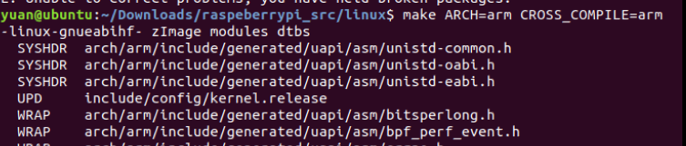    
  在编译过程中出现如下错误：  
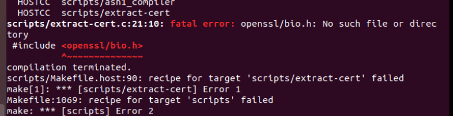  
经百度[“fatal error: openssl/bio.h: No such file or directory”](https://blog.csdn.net/beilson/article/details/79774036),得到如下解决方案:  
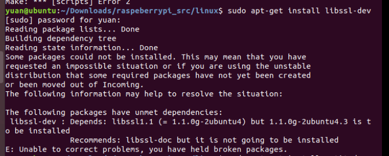  
按照错误提示安装libssl-dev,又出现了新的错误，再次查询["libssl-dev 安装失败 解决方案"](https://blog.csdn.net/andy812110/article/details/24842219)得到如下解决方案:  
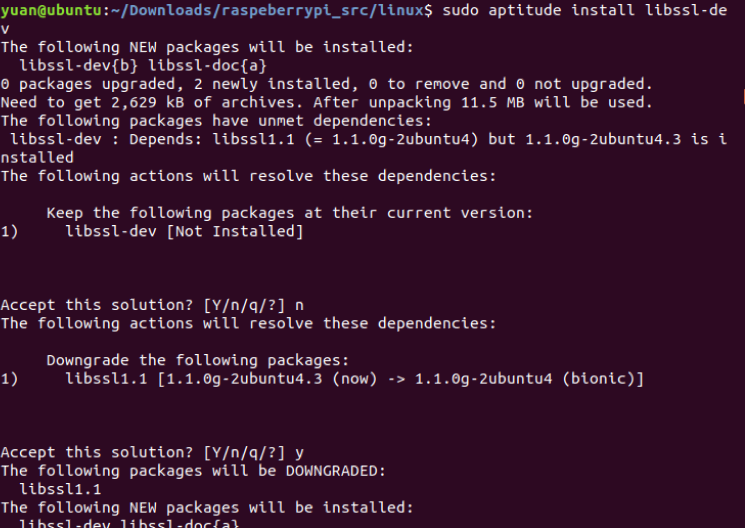   
安装完成后，再对内核经行编译   
```
make ARCH=arm CROSS_COMPILE=arm-linux-gnueabihf- zImage modules dtbs 
```  
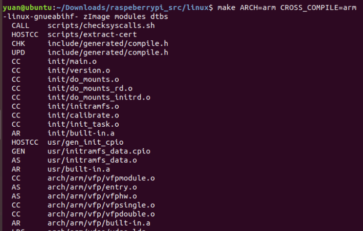   
编译成功！

- 挂载SD卡  
将SD卡插入PC，然后用lsblk查看SD卡分区情况  

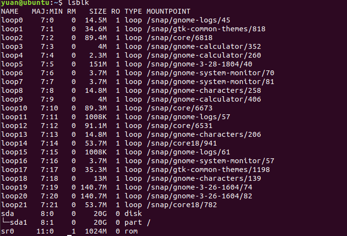   
没有找到SD卡的分区，经分析SD卡在主机分区内，不在虚拟机分区内，则参考[windows 与 Centos7 共享文件方法](http://www.bubuko.com/infodetail-2851315.html)尝试开启主机与虚拟机的文件共享，并将SD卡挂载在虚拟机上，得到如下结果：  
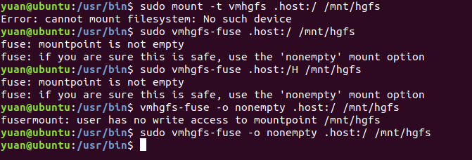   
但还是未能成功。
最终发现虚拟机不能读取SDHC读卡器的分区！改用USB读卡器后，成功读取了SD卡的分区。  
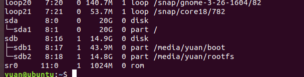   
执行如下指令，  
```
mkdir mnt
mkdir mnt/fat32
mkdir mnt/ext4
sudo mount /dev/sdb1 mnt/fat32 （mnt/fat32指向/dev/sdb1）
sudo mount /dev/sdb2 mnt/ext4  （mnt/ext4指向/dev/sdb2）
```  
创建fat32和ext4目录，并将fat32挂载到sdb1中，将ext4挂载到sdb2中  
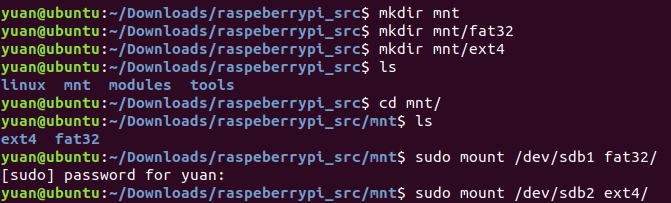    

- 将内核和设备数拷贝到SD卡上  
将文件目录挂载成功后，执行如下指令：  
```
sudo cp mnt/fat32/$KERNEL.img mnt/fat32/$KERNEL-backup.img  （备份旧内核）
sudo cp arch/arm/boot/zImage mnt/fat32/$KERNEL.img （新内核拷贝至启动分区）
sudo cp arch/arm/boot/dts/*.dtb mnt/fat32/       （拷贝设备树）
sudo cp arch/arm/boot/dts/overlays/*.dtb* mnt/fat32/overlays/
sudo cp arch/arm/boot/dts/overlays/README mnt/fat32/overlays/
sudo umount mnt/fat32    （解除挂载）
sudo umount mnt/ext4
```  
此时内核大小为5M  
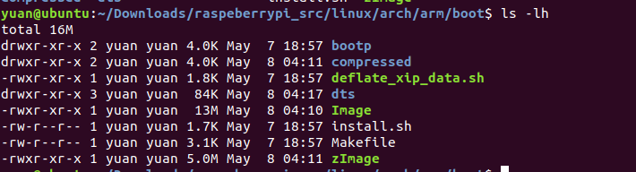    

- 查看编译得到内核是否行得通  
将SD卡放回树莓派，上电运行
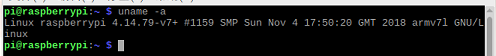  
成功！
## 2.内核裁剪并配置编译  

- 内核裁剪  
 先生成默认的config文件，  
```
make ARCH=arm CROSS_COMPILE=arm-linux-gnueabihf- bcm2709_defconfig
```  
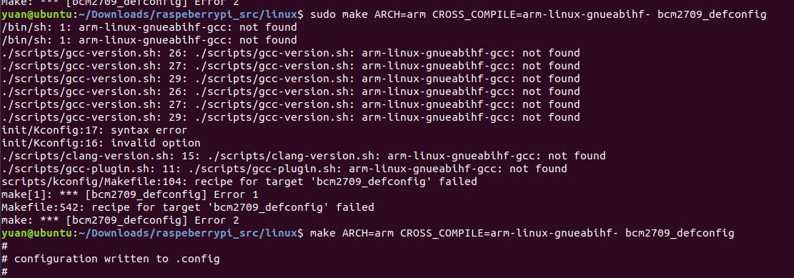  
再进入menuconfig进行配置  
```
make ARCH=arm CROSS_COMPILE=arm-linux-gnueabihf- menuconfig
```  
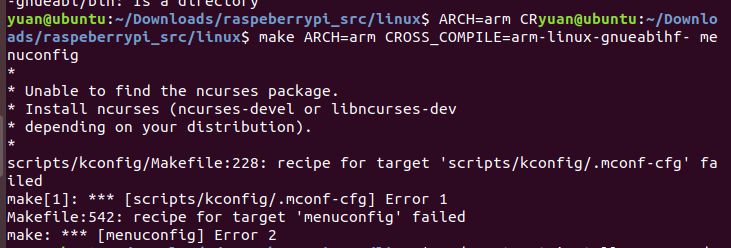  
这个问题和上面的类似，采用相同的解决方案  
进入menuconfig  
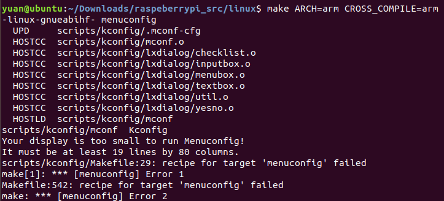  
把终端窗口屏幕放大  
  
 
经分析，以下部分在本项目中用不到，故进行了裁剪  
 1. networking--->wireless--->cfg80211: 用于对无线设备进行配置管理  
 2. amateur radio support      业余广播支持   
 3. Bluetooth subsystem support    蓝牙子系统支持
 4. WiMAX Wireless Broadband support    无线支持
 5. NFC subsystem support       NFC子系统支持
 6. CAN bus subsystem support  CAN总线子系统支持
 7. Namespaces support       命名空间
 8. 对支持的压缩包格式进行裁剪
[*]  Support initial ramdisks compressed using gzip                                                                              
[*]  Support initial ramdisks compressed using bzip2                                                                                
[ ]  Support initial ramdisks compressed using LZMA                                                                                 
[ ]  Support initial ramdisks compressed using XZ                                                                                  
[ ]  Support initial ramdisks compressed using LZO                                                                                 
[ ]  Support initial ramdisks compressed using LZ4   
 9. device drivers---> Input device support  ---> Touchscreens     触摸屏
 10. device drivers---> Input device support  ---> joystick interface   游戏杆
 11. analog devices ADXL34x Three-Axis Digital Accelerometer  三轴加速度计
 VTI CMA3000 Tri-axis accelerometer      三轴加速度计
 12. ATI/Philips USB RF remote control     USB射频远程控制
 13. Analog Devices AD714x Capacitance Touch Sensor   电容式触摸传感器  

 裁剪后得到如下.config文件

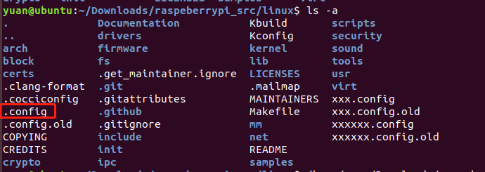  

- 编译挂载并拷贝到SD卡  
编译
  
得到的内核大小为4.9M，可以看到比原来小了
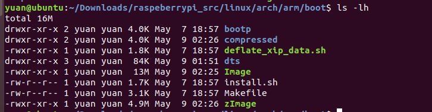  
然后重复第一次的操作，将内核和设备树拷贝到SD卡  
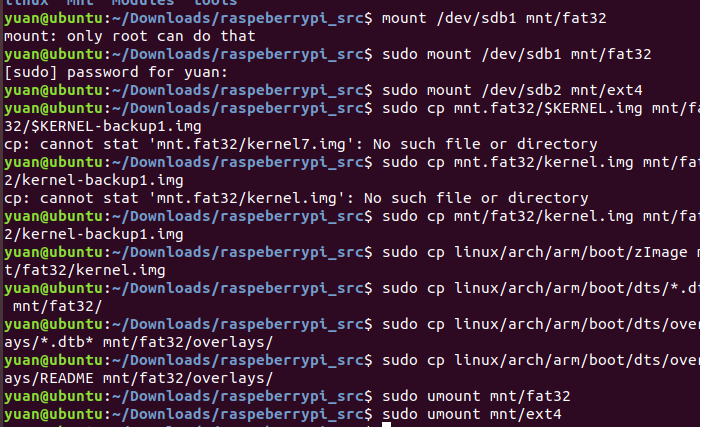  

- 运行测试
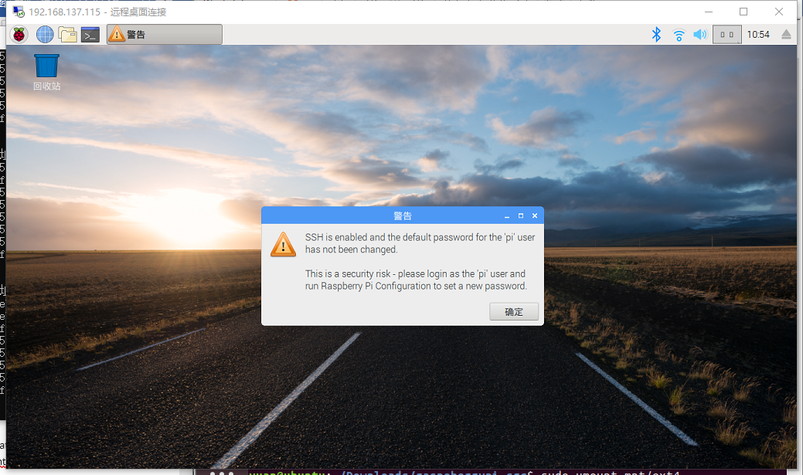  

## 3.模块卸载与加载  
- 查看系统模块状态  
```
    lsmod
```  
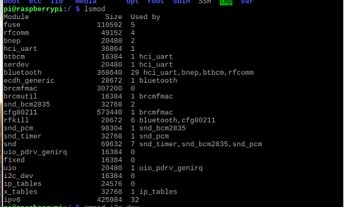   
- 卸载一个模块  
这里卸载的是i2c_dev这个模块  
```
sudo rmmod i2c_dev
```
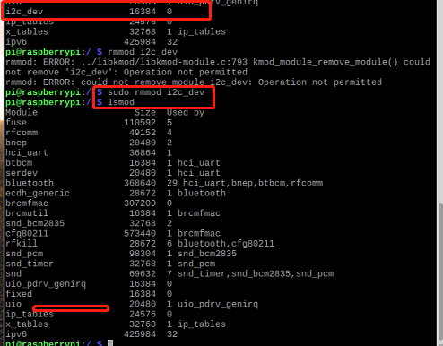  
可以看到卸载成功  
- 加载一个模块  
 这里加载的是 gpio-arizona这个模块 
```
sudo insmod gpio-arizona.ko
```
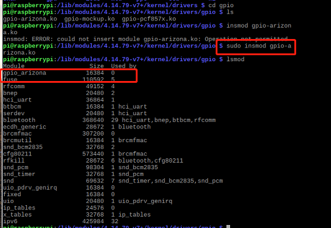   
加载成功！  

## 4.创建文件系统 

- 使用fdisk增加分区  
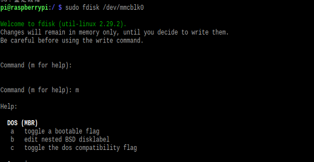  

- 第一步创建扩展分区，剩余空间全部用于扩展   
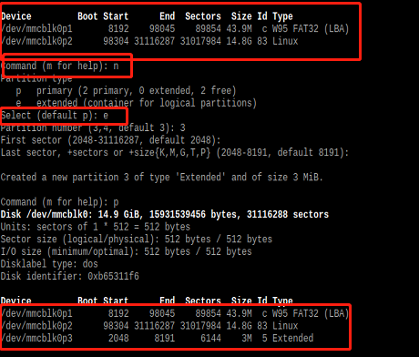  

- 第二步根据需要创建逻辑分区  
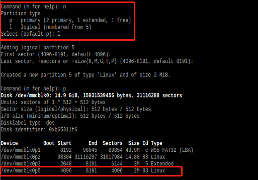  
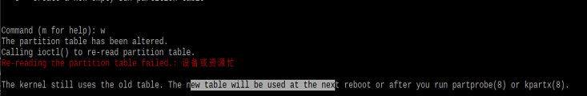  
可以看到，需要线重启或运行partprobe程序才可以分区成功，故reboot树莓派，发现还是不行，运行partprobe程序

- 第三步对每个分区格式化需要的fs  
```
  mkfs –t ext2 /dev/mmcblk0p5
```
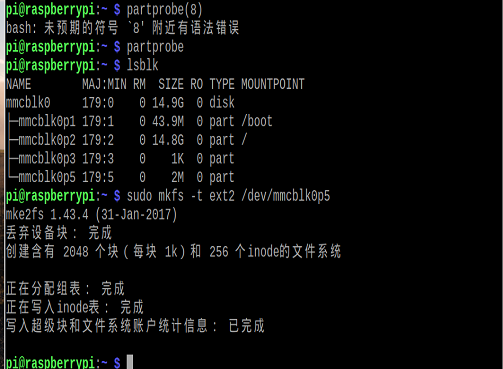  

- 第四步将每个分区mount到某挂载点  
```
  mount –t ext2 /dev/mmcblk0p5 /mnt/ext2fs
```
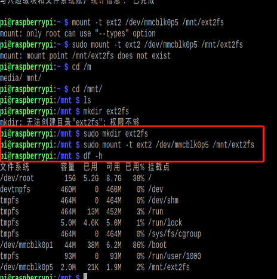  


>>>>>>> Freedom
